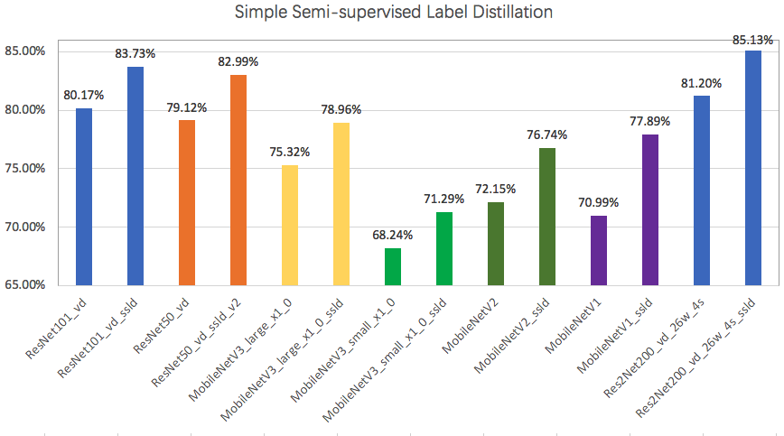
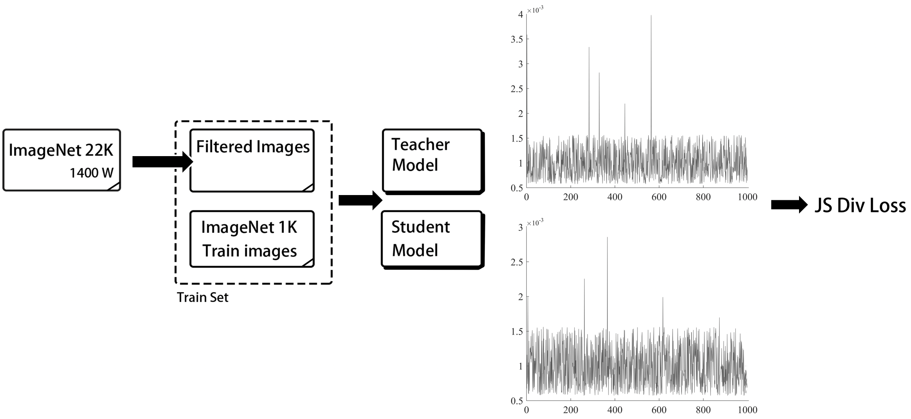
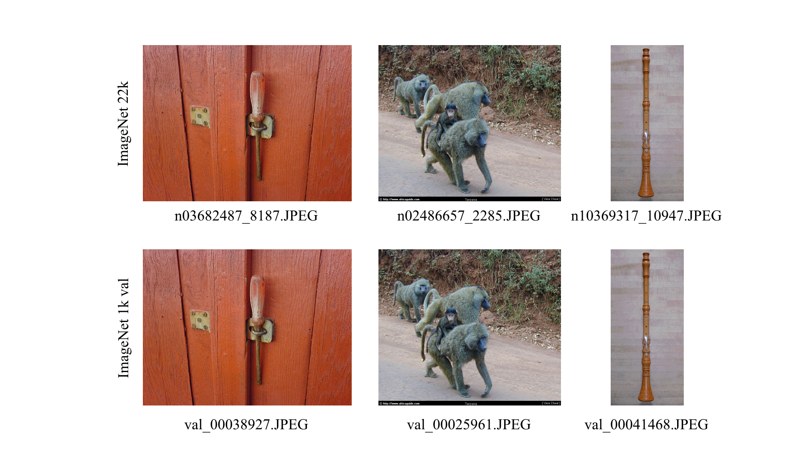

# Introduction of model compression methods

In recent years, deep neural networks have been proven to be an extremely effective method to solve problems in the fields of computer vision and natural language processing. The deep learning methods performs better than traditional methods with suitable network structure and training process.

With enough training data, increasing parameters of the neural network by building a reasonabe network can significantly the model performance. But this increases the model complexity, which takes too much computation cost in real scenarios.


Parameter redundancy exists in deep neural networks. There are several methods to compress the model such as pruning ,quantization, knowledge distillation, etc. Knowledge distillation refers to using the teacher model to guide the student model to learn specific tasks, ensuring that the small model has a relatively large effect improvement with the computation cost unchanged, and even obtains similar accuracy with the large model [1]. Combining some of the existing distillation methods [2,3], PaddleClas provides a simple semi-supervised label knowledge distillation solution (SSLD). Top-1 Accuarcy on ImageNet1k dataset has an improvement of more than 3% based on ResNet_vd and MobileNet series, which can be shown as below.





# SSLD

## Introduction

The following figure shows the framework of SSLD.



First, we select nearly 4 million images from ImageNet22k dataset, and integrate it with the ImageNet-1k training set to get a new dataset containing 5 million images. Then, we combine the student model and the teacher model into a new network, which outputs the predictions of the student model and the teacher model, respectively. The gradient of the entire network of the teacher model is fixed. Finally, we use JS divergence loss as the loss function for the training process. Here we take MobileNetV3 distillation task as an example, and introduce key points of SSLD.

* Choice of the teacher model, During knowledge distillation, it may not be an optimal solution if the structure of the teacher model and the student model are too different. Under the same structure, the teacher model with higher accuracy leads to better performance for the student model during distillation. Compared with the 79.12% ResNet50_vd teacher model, using the 82.4% teacher model can bring a 0.4% accuracy improvement on Top-1 accuracy (`75.6%-> 76.0%`).

* Improvement of loss function. The most commonly used loss function for classification is cross entropy loss. We fint that when using soft label for training, KL divergence loss is almost useless to improve model performance compared to cross entropy loss, but The accuracy has a 0.2% improvement using JS divergence loss (`76.0%-> 76.2%`). Loss function in SSLD is JS divergence loss.

* More iteration number. It is only 120 for the baseline experiment. We can achieve a 0.9% improvement by setting it as 360 (`76.2%-> 77.1%`).

* There is not need for laleled data in SSLD, which leads to convenient training data expansion. label is not utilized when computing the loss function, therefore the unlabeled data can also be used to train the network. The label-free distillation strategy of this distillation solution has also greatly improved the upper performance limit of student models (`77.1%-> 78.5%`).

* ImageNet1k finetune. ImageNet1k training set is used for finetuning, which brings a 0.4% accuracy improvement (`78.5%-> 78.9%`).


## Data selection

* An important feature of the SSLD distillation scheme is no need for labeled images, so the dataset size can be arbitrarily expanded. Considering the limitation of computing resources, we here only expand the training set of the distillation task based on the ImageNet22k dataset. For SSLD, we used the `Top-k per class` data sampling scheme [3]. Specific steps are as follows.
     * Deduplication of training set. We first deduplicate the ImageNet22k dataset and the ImageNet1k validation set based on the SIFT feature similarity matching method to prevent the added ImageNet22k training set from containing the ImageNet1k validation set images. Finally we removed 4511 similar images. Similar pictures with partial filtering are shown below.

    

    * Obtain the soft label of the ImageNet22k dataset. For the ImageNet22k dataset after deduplication, we use the `ResNeXt101_32x16d_wsl` model to make predictions to obtain the soft label of each image.
     * Top-k data selection. There contains 1000 categories in ImageNet1k dataset. For each category, we find out images in the category with Top-k highest score, and finally generate a dataset whose image number does not exceed `1000 * k` (For some categories, there may contain less than k images).
     * The selected images are merged with the ImageNet1k training set to form the new dataset used for the final distillation model training, which contains 5 million images in all.

# Experiments

The distillation solution that PaddleClas provides is combining common training with finetuning. Given a suitable teacher model, the large dataset(5 million) is used for common training and the ImageNet1k dataset is used for finetuning.

## Choice of teacher model

In order to verify the influence of the model size difference between the teacher model and the student model on the distillation results as well as the teacher model accuracy, we conducted several experiments. The training strategy is unified as follows: `cosine_decay_warmup, lr = 1.3, epoch = 120, bs = 2048`, and the student models are all trained from scratch.


|Teacher Model | Teacher Top1 | Student Model | Student Top1|
|- |:-: |:-: | :-: |
| ResNeXt101_32x16d_wsl | 84.2% | MobileNetV3_large_x1_0 | 75.78% |
| ResNet50_vd | 79.12% | MobileNetV3_large_x1_0 | 75.60% |
| ResNet50_vd | 82.35% | MobileNetV3_large_x1_0 | 76.00% |


It can be shown from the table that:

> When the teacher model structure is the same, the higher the teacher model accuracy, the better the final student model will be.
>
> The size difference between the teacher model and the student model should not be too large, otherwise it will decrease the accuracy of the distillation results.

Therefore, during distillation, for the ResNet series student model, we use `ResNeXt101_32x16d_wsl` as the teacher model; for the MobileNet series student model, we use` ResNet50_vd_SSLD` as the teacher model.


## Distillation using large-scale dataset

Training process is carried out on the large-scale dataset with 5 million images. Specifically, the following table shows more details of different models.

|Student Model | num_epoch  | l2_ecay | batch size/gpu cards |  base lr | learning rate decay | top1 acc |
| - |:-: |:-: | :-: |:-: |:-: |:-: |
| MobileNetV1 | 360 | 3e-5 | 4096/8  | 1.6 | cosine_decay_warmup | 77.65% |
| MobileNetV2 | 360 | 1e-5 | 3072/8  | 0.54 | cosine_decay_warmup | 76.34% |
| MobileNetV3_large_x1_0 | 360 | 1e-5 |  5760/24 | 3.65625 | cosine_decay_warmup | 78.54% |
| MobileNetV3_small_x1_0 | 360 | 1e-5 |  5760/24 | 3.65625 | cosine_decay_warmup | 70.11% |
| ResNet50_vd | 360 | 7e-5 | 1024/32 | 0.4 | cosine_decay_warmup | 82.07% |
| ResNet101_vd | 360 | 7e-5 | 1024/32 | 0.4 | cosine_decay_warmup | 83.41% |
| Res2Net200_vd_26w_4s | 360 | 4e-5 | 1024/32 | 0.4 | cosine_decay_warmup | 84.82% |

## finetuning using ImageNet1k

Finetuning is carried out on ImageNet1k dataset to restore distribution between training set and test set. the following table shows more details of finetuning.


|Student Model | num_epoch  | l2_ecay | batch size/gpu cards |  base lr | learning rate decay |  top1 acc |
| - |:-: |:-: | :-: |:-: |:-: |:-: |
| MobileNetV1 | 30 | 3e-5 | 4096/8 | 0.016 | cosine_decay_warmup | 77.89%  |
| MobileNetV2 | 30 | 1e-5 | 3072/8  | 0.0054 | cosine_decay_warmup | 76.73% |
| MobileNetV3_large_x1_0 | 30 | 1e-5 |  2048/8 | 0.008 | cosine_decay_warmup | 78.96% |
| MobileNetV3_small_x1_0 | 30 | 1e-5 |  6400/32 | 0.025 | cosine_decay_warmup | 71.28% |
| ResNet50_vd | 60 | 7e-5 | 1024/32 | 0.004 | cosine_decay_warmup | 82.39% |
| ResNet101_vd | 30 | 7e-5 | 1024/32 | 0.004 | cosine_decay_warmup | 83.73% |
| Res2Net200_vd_26w_4s | 360 | 4e-5 | 1024/32 | 0.004 | cosine_decay_warmup | 85.13% |

## Data agmentation and Fix strategy

* Based on experiments mentioned above, we add AutoAugment [4] during training process, and reduced l2_decay from 4e-5 t 2e-5. Finally, the Top-1 accuracy on ImageNet1k dataset can reach 82.99%, with 0.6% improvement compared to the standard SSLD distillation strategy.

* For image classsification tasks, The model accuracy can be further improved when the test scale is 1.15 times that of training[5]. For the 82.99% ResNet50_vd pretrained model, it comes to 83.7% using 320x320 for the evaluation. We use Fix strategy to finetune the model with the training scale set as 320x320. During the process, the pre-preocessing pipeline is same for both training and test. All the weights except the fully connected layer are freezed. Finally the top-1 accuracy comes to **84.0%**.


# Application of the distillation model

## Instructions

* Adjust the learning rate of the middle layer. The middle layer feature map of the model obtained by distillation is more refined. Therefore, when the distillation model is used as the pretrained model in other tasks, if the same learning rate as before is adopted, it is easy to destroy the features. If the learning rate of the overall model training is reduced, it will bring about the problem of slow convergence. Therefore, we use the strategy of adjusting the learning rate of the middle layer. specifically:
    * For ResNet50_vd, we set up a learning rate list. The three conv2d convolution parameters before the resiual block have a uniform learning rate multiple, and the four resiual block conv2d have theirs own learning rate parameters, respectively. 5 values need to be set in the list. By the experiment, we find that when used for transfer learning finetune classification model, the learning rate list with `[0.1,0.1,0.2,0.2,0.3]` performs better in most tasks; while in the object detection tasks, `[0.05, 0.05, 0.05, 0.1, 0.15]` can bring greater accuracy gains.
    * For MoblileNetV3_large_1x0, because it contains 15 blocks, we set each 3 blocks to share a learning rate, so 5 learning rate values are required. We find that in classification and detection tasks, the learning rate list with `[0.25, 0.25, 0.5, 0.5, 0.75]` performs better in most tasks.
* Appropriate l2 decay. Different l2 decay values are set for different models during training. In order to prevent overfitting, l2 decay is ofen set as large for large models. L2 decay is set as `1e-4` for ResNet50, and `1e-5 ~ 4e-5` for MobileNet series models. L2 decay needs also to be adjusted when applied in other tasks. Taking Faster_RCNN_MobiletNetV3_FPN as an example, we found that only modifying l2 decay can bring up to 0.5% accuracy (mAP) improvement on the COCO2017 dataset.


## Transfer learning

* To verify the effect of the SSLD pretrained model in transfer learning, we carried out experiments on 10 small datasets. Here, in order to ensure the comparability of the experiment, we use the standard preprocessing process trained by the ImageNet1k dataset. For the distillation model, we also add a simple search method for the learning rate of the middle layers of the distillation pretrained model.
* For ResNet50_vd, the baseline pretrained model Top-1 Acc is 79.12%, the other parameters are got by grid search. For distillation pretrained model, we add learning rate of the middle layers into the search space. The following table shows the results.

| Dataset | Model | Baseline Top1 Acc | Distillation Model Finetune |
|- |:-: |:-: | :-: |
| Oxford102 flowers | ResNete50_vd | 97.18% | 97.41% |
| caltech-101 | ResNete50_vd | 92.57% | 93.21% |
| Oxford-IIIT-Pets | ResNete50_vd | 94.30% | 94.76% |
| DTD | ResNete50_vd | 76.48% | 77.71% |
| fgvc-aircraft-2013b | ResNete50_vd | 88.98% | 90.00% |
| Stanford-Cars | ResNete50_vd | 92.65% | 92.76% |
| SUN397 | ResNete50_vd | 64.02% | 68.36% |
| cifar100 | ResNete50_vd | 86.50% | 87.58% |
| cifar10 | ResNete50_vd | 97.72% | 97.94% |
| Food-101 | ResNete50_vd | 89.58% | 89.99% |

* It can be seen that on the above 10 datasets, combined with the appropriate middle layer learning rate, the distillation pretrained model can bring an average accuracy improvement of more than 1%.

## Object detection


Based on the two-stage Faster/Cascade RCNN model, we verify the effect of the pretrained model obtained by distillation.

* ResNet50_vd

Training scale and test scale are set as 640x640, and some of the ablationstudies are as follows.


| Model | train/test scale | pretrain top1 acc | feature map lr | coco mAP |
|- |:-: |:-: | :-: | :-: |
| Faster RCNN R50_vd FPN | 640/640 | 79.12% | [1.0,1.0,1.0,1.0,1.0] | 34.8% |
| Faster RCNN R50_vd FPN | 640/640 | 79.12% | [0.05,0.05,0.1,0.1,0.15] | 34.3% |
| Faster RCNN R50_vd FPN | 640/640 | 82.18% | [0.05,0.05,0.1,0.1,0.15] | 36.3% |


It can be seen here that for the baseline pretrained model, excessive adjustment of the middle-layer learning rate actually reduces the performance of the detection model. Based on this distillation model, we also provide a practical server-side detection solution. The detailed configuration and training code are open source, more details can be refer to [PaddleDetection] (https://github.com/PaddlePaddle/PaddleDetection/tree/master/configs/rcnn_enhance).


# Practice

This section will introduce the SSLD distillation experiments in detail based on the ImageNet-1K dataset. If you want to experience this method quickly, you can refer to [** Quick start PaddleClas in 30 minutes**] (../../tutorials/quick_start.md), whose dataset is set as Flowers102.


## Configuration


### Distill ResNet50_vd using ResNeXt101_32x16d_wsl

Configuration of distilling `ResNet50_vd` using `ResNeXt101_32x16d_wsl` is as follows.

```yaml
ARCHITECTURE:
    name: 'ResNeXt101_32x16d_wsl_distill_ResNet50_vd'
pretrained_model: "./pretrained/ResNeXt101_32x16d_wsl_pretrained/"
# pretrained_model:
#     - "./pretrained/ResNeXt101_32x16d_wsl_pretrained/"
#     - "./pretrained/ResNet50_vd_pretrained/"
use_distillation: True
```

### Distill MobileNetV3_large_x1_0 using ResNet50_vd_ssld

The detailed configuration is as follows.

```yaml
ARCHITECTURE:
    name: 'ResNet50_vd_distill_MobileNetV3_large_x1_0'
pretrained_model: "./pretrained/ResNet50_vd_ssld_pretrained/"
# pretrained_model:
#     - "./pretrained/ResNet50_vd_ssld_pretrained/"
#     - "./pretrained/ResNet50_vd_pretrained/"
use_distillation: True
```

## Begin to train the network

If everything is ready, users can begin to train the network using the following command.

```bash
export PYTHONPATH=path_to_PaddleClas:$PYTHONPATH

python -m paddle.distributed.launch \
    --selected_gpus="0,1,2,3" \
    --log_dir=R50_vd_distill_MV3_large_x1_0 \
    tools/train.py \
        -c ./configs/Distillation/R50_vd_distill_MV3_large_x1_0.yaml
```

## Note

* Before using SSLD, users need to train a teacher model on the target dataset firstly. The teacher model is used to guide the training of the student model.

* When using SSLD, users need to set `use_distillation` in the configuration file to` True`. In addition, because the student model learns soft-label with knowledge information, you need to turn off the `label_smoothing` option.

* If the student model is not loaded with a pretrained model, the other hyperparameters of the training can refer to the hyperparameters trained by the student model on ImageNet-1k. If the student model is loaded with the pre-trained model, the learning rate can be adjusted to `1/100~1/10` of the standard learning rate.

* In the process of SSLD distillation, the student model only learns the soft label, which makes the training process more difficult. It is recommended that the value of `l2_decay` can be decreased appropriately to obtain higher accuracy of the validation set.

* If users are going to add unlabeled training data, just the training list textfile needs to be adjusted for more data.


> If this document is helpful to you, welcome to star our project: [https://github.com/PaddlePaddle/PaddleClas](https://github.com/PaddlePaddle/PaddleClas)


# Reference

[1] Hinton G, Vinyals O, Dean J. Distilling the knowledge in a neural network[J]. arXiv preprint arXiv:1503.02531, 2015.

[2] Bagherinezhad H, Horton M, Rastegari M, et al. Label refinery: Improving imagenet classification through label progression[J]. arXiv preprint arXiv:1805.02641, 2018.

[3] Yalniz I Z, Jégou H, Chen K, et al. Billion-scale semi-supervised learning for image classification[J]. arXiv preprint arXiv:1905.00546, 2019.

[4] Cubuk E D, Zoph B, Mane D, et al. Autoaugment: Learning augmentation strategies from data[C]//Proceedings of the IEEE conference on computer vision and pattern recognition. 2019: 113-123.

[5] Touvron H, Vedaldi A, Douze M, et al. Fixing the train-test resolution discrepancy[C]//Advances in Neural Information Processing Systems. 2019: 8250-8260.
