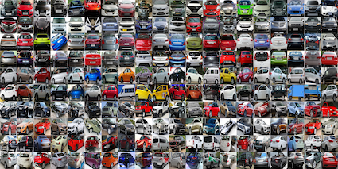

# 车辆识别
此部分主要包含两部分：车辆细粒度分类、车辆ReID。

细粒度分类，是对属于某一类基础类别的图像进行子类别的细粉，如各种鸟、各种花、各种矿石之间。顾名思义，车辆细粒度分类是对车辆的不同子类别进行分类。

ReID，也就是 Re-identification，其定义是利用算法，在图像库中找到要搜索的目标的技术，所以它是属于图像检索的一个子问题。而车辆ReID就是给定一张车辆图像，找出同一摄像头不同的拍摄图像，或者不同摄像头下拍摄的同一车辆图像的过程。在此过程中，如何提取鲁棒特征，尤为重要。

此文档中，使用同一套训练方案对两个细方向分别做了尝试。

## 1 算法介绍
算法整体流程，详见[特征学习](./feature_learning.md)整体流程。

车辆ReID整体设置详见: [ResNet50_ReID.yaml](../../../ppcls/configs/Vehicle/ResNet50_ReID.yaml)。

车辆细分类整体设置详见：[ResNet50.yaml](../../../ppcls/configs/Vehicle/ResNet50.yaml)

具体细节如下所示。

### 1.1数据增强

与普通训练分类不同，此部分主要使用如下图像增强方式：

- 图像`Resize`到224。尤其对于ReID而言，车辆图像已经是由检测器检测后crop出的车辆图像，因此若再使用crop图像增强，会丢失更多的车辆信息
- [AugMix](https://arxiv.org/abs/1912.02781v1)：模拟光照变化、摄像头位置变化等实际场景
- [RandomErasing](https://arxiv.org/pdf/1708.04896v2.pdf)：模拟遮挡等实际情况

### 1.2 Backbone的具体设置

使用`ResNet50`作为backbone，同时做了如下修改：

 - last stage stride=1, 保持最后输出特征图尺寸14x14。计算量增加较小，但显著提高模型特征提取能力

具体代码：[ResNet50_last_stage_stride1](../../../ppcls/arch/backbone/variant_models/resnet_variant.py)

### 1.3 Neck部分

为了降低inferecne时计算特征距离的复杂度，添加一个embedding 卷积层，特征维度为512。

### 1.4 Metric Learning相关Loss的设置

- 车辆ReID中，使用了[SupConLoss](../../../ppcls/loss/supconloss.py) + [ArcLoss](../../../ppcls/arch/gears/arcmargin.py)，其中权重比例为1:1
- 车辆细分类，使用[TtripLet Loss](../../../ppcls/loss/triplet.py) + [ArcLoss](../../../ppcls/arch/gears/arcmargin.py)，其中权重比例为1:1

## 2 实验结果

### 2.1 车辆ReID

此方法在VERI-Wild数据集上进行了实验。此数据集是在一个大型闭路电视监控系统，在无约束的场景下，一个月内（30*24小时）中捕获的。该系统由174个摄像头组成，其摄像机分布在200多平方公里的大型区域。原始车辆图像集包含1200万个车辆图像，经过数据清理和标注，采集了416314张40671个不同的车辆图像。[具体详见论文](https://github.com/PKU-IMRE/VERI-Wild)

|         **Methods**          | **Small** |           |           |
| :--------------------------: | :-------: | :-------: | :-------: |
|                              |    mAP    |   Top1    |   Top5    |
| Strong baesline(Resnet50)[1] |   76.61   |   90.83   |   97.29   |
|    HPGN(Resnet50+PGN)[2]     |   80.42   |   91.37   |     -     |
|   GLAMOR(Resnet50+PGN)[3]    |   77.15   |   92.13   |   97.43   |
|      PVEN(Resnet50)[4]       |   79.8    |   94.01   |   98.06   |
|    SAVER(VAE+Resnet50)[5]    |   80.9    |   93.78   |   97.93   |
|    PaddleClas  baseline1     |   65.6    |   92.37   |   97.23   |
|    PaddleClas  baseline2     |   80.09   | **93.81** | **98.26** |

注：baseline1 为目前的开源模型，baseline2即将开源

### 2.2 车辆细分类

车辆细分类中，使用[CompCars](http://mmlab.ie.cuhk.edu.hk/datasets/comp_cars/index.html)作为训练数据集。

数据集中图像主要来自网络和监控数据，其中网络数据包含163个汽车制造商、1716个汽车型号的汽车。共**136,726**张全车图像，**27,618**张部分车图像。其中网络汽车数据包含bounding box、视角、5个属性（最大速度、排量、车门数、车座数、汽车类型）。监控数据包含**50,000**张前视角图像。
值得注意的是，此数据集中需要根据自己的需要生成不同的label，如本demo中，将不同年份生产的相同型号的车辆视为同一类，因此，类别总数为：431类。

|           **Methods**           | Top1 Acc  |
| :-----------------------------: | :-------: |
|        ResNet101-swp[6]         |   97.6%   |
|      Fine-Tuning DARTS[7]       |   95.9%   |
|       Resnet50 + COOC[8]        |   95.6%   |
|             A3M[9]              |   95.4%   |
| PaddleClas  baseline (ResNet50) | **97.1**% |

## 3 参考文献

[1] Bag of Tricks and a Strong Baseline for Deep Person Re-Identification.CVPR workshop 2019.

[2] Exploring Spatial Significance via Hybrid Pyramidal Graph Network for Vehicle Re-identification. In arXiv preprint arXiv:2005.14684

[3] GLAMORous: Vehicle Re-Id in Heterogeneous Cameras Networks with Global and Local Attention. In arXiv preprint arXiv:2002.02256

[4] Parsing-based view-aware embedding network for vehicle re-identification. CVPR 2020.

[5] The Devil is in the Details: Self-Supervised Attention for Vehicle Re-Identification. In ECCV 2020.

[6] Deep CNNs With Spatially Weighted Pooling for Fine-Grained Car Recognition. IEEE Transactions on Intelligent Transportation Systems, 2017.

[7] Fine-Tuning DARTS for Image Classification. 2020.

[8] Fine-Grained Vehicle Classification with Unsupervised Parts Co-occurrence Learning. 2018

[9] Attribute-Aware Attention Model for Fine-grained Representation Learning. 2019.
