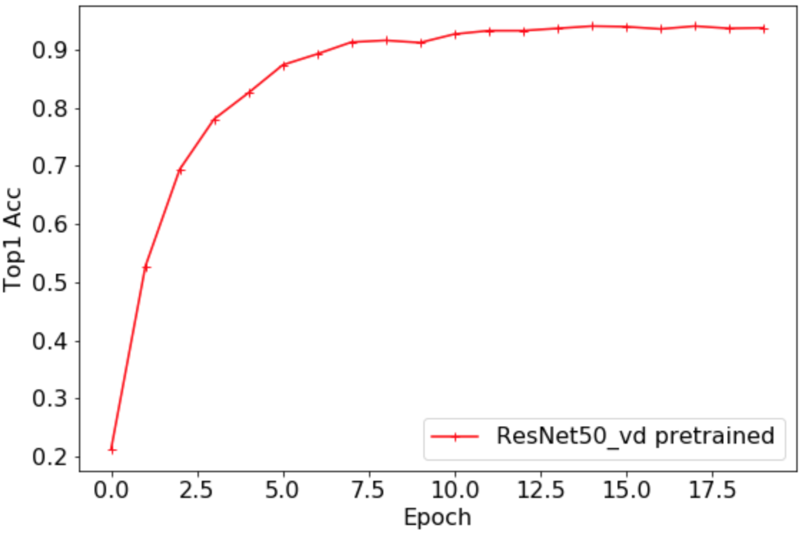
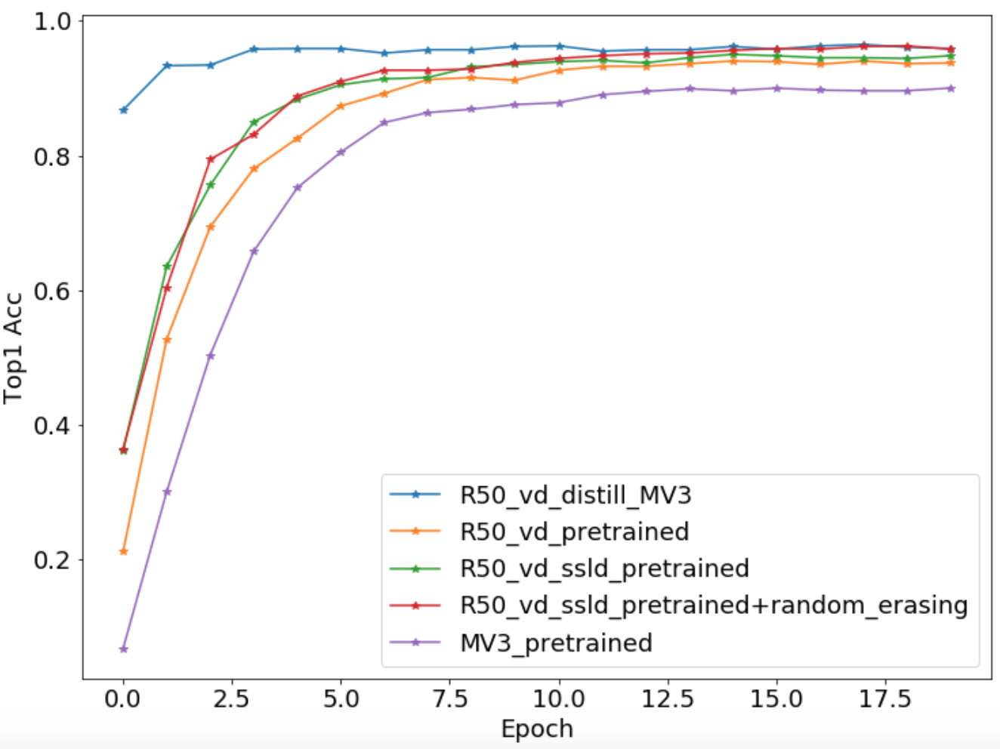

# 30分钟玩转PaddleClas

基于flowers102数据集，30分钟体验PaddleClas不同骨干网络的模型训练、不同预训练模型、SSLD知识蒸馏方案和数据增广的效果。请事先参考[安装指南](install.md)配置运行环境和克隆PaddleClas代码。


## 一、数据和模型准备

* 进入PaddleClas目录。

```
cd path_to_PaddleClas
```

* 进入`dataset/flowers102`目录，下载并解压flowers102数据集.

```shell
cd dataset/flowers102
wget https://www.robots.ox.ac.uk/~vgg/data/flowers/102/102flowers.tgz
wget https://www.robots.ox.ac.uk/~vgg/data/flowers/102/imagelabels.mat
wget https://www.robots.ox.ac.uk/~vgg/data/flowers/102/setid.mat
tar -xf 102flowers.tgz
```

* 制作train/val/test标签文件

```shell
python generate_flowers102_list.py jpg train > train_list.txt
python generate_flowers102_list.py jpg valid > val_list.txt
python generate_flowers102_list.py jpg test > extra_list.txt
cat train_list.txt extra_list.txt > train_extra_list.txt
```

**注意**：这里将train_list.txt和extra_list.txt合并成train_extra_list.txt，是为了之后在进行知识蒸馏时，使用更多的数据提升无标签知识蒸馏任务的效果。

* 返回`PaddleClas`根目录

```
cd ../../
```

## 二、环境准备

### 2.1 设置PYTHONPATH环境变量

```bash
export PYTHONPATH=./:$PYTHONPATH
```

### 下载预训练模型
通过tools/download.py下载所需要的预训练模型。

```bash
python tools/download.py -a ResNet50_vd -p ./pretrained -d True
python tools/download.py -a ResNet50_vd_ssld -p ./pretrained -d True
python tools/download.py -a MobileNetV3_large_x1_0 -p ./pretrained -d True
```

参数说明：
+ `architecture`（简写 a）：模型结构
+ `path`（简写 p）：下载路径
+ `decompress` （简写 d）：是否解压

### 2.2 环境说明

* 下面所有的训练过程均在`单卡V100`机器上运行。


## 三、模型训练

### 3.1 零基础训练：不加载预训练模型的训练

* 基于ResNet50_vd模型，训练脚本如下所示。

```shell
export CUDA_VISIBLE_DEVICES=0
python -m paddle.distributed.launch \  
    --selected_gpus="0" \  
    tools/train.py \  
        -c ./configs/quick_start/ResNet50_vd.yaml

```

`Top1 Acc`曲线如下所示，最高准确率为0.2735。


### 3.2 模型微调-基于ResNet50_vd预训练模型(准确率79.12\%)

* 基于ImageNet1k分类预训练模型进行微调，训练脚本如下所示。

```shell
export CUDA_VISIBLE_DEVICES=0
python -m paddle.distributed.launch \  
    --selected_gpus="0" \  
    tools/train.py \  
        -c ./configs/quick_start/ResNet50_vd_finetune.yaml

```

`Top1 Acc`曲线如下所示，最高准确率为0.9402，加载预训练模型之后，flowers102数据集精度大幅提升，绝对精度涨幅超过65\%。



### 3.3 SSLD模型微调-基于ResNet50_vd_ssld预训练模型(准确率82.39\%)


需要注意的是，在使用通过知识蒸馏得到的预训练模型进行微调时，我们推荐使用相对较小的网络中间层学习率。


```yaml
ARCHITECTURE:
    name: 'ResNet50_vd'
    params:
        lr_mult_list: [0.1, 0.1, 0.2, 0.2, 0.3]
pretrained_model: "./pretrained/ResNet50_vd_ssld_pretrained"
```

训练脚本如下。
```shell
export CUDA_VISIBLE_DEVICES=0
python -m paddle.distributed.launch \  
    --selected_gpus="0" \  
    tools/train.py \  
        -c ./configs/quick_start/ResNet50_vd_ssld_finetune.yaml
```

最终flowers102验证集上精度指标为0.95，相对于79.12\%预训练模型的微调结构，新数据集指标可以再次提升0.9\%。


### 3.4 尝试更多的模型结构-MobileNetV3

训练脚本如下所示。

```shell
export CUDA_VISIBLE_DEVICES=0
python -m paddle.distributed.launch \  
    --selected_gpus="0" \  
    tools/train.py \  
        -c ./configs/quick_start/MobileNetV3_large_x1_0_finetune.yaml
```

最终flowers102验证集上的精度为0.90，比加载了预训练模型的ResNet50_vd的精度差了5\%。不同模型结构的网络在相同数据集上的性能表现不同，需要根据预测耗时以及存储的需求选择合适的模型。


### 3.5 数据增广的尝试-RandomErasing

训练数据量较小时，使用数据增广可以进一步提升模型精度，基于`3.3节`中的训练方法，结合RandomErasing的数据增广方式进行训练，具体的训练脚本如下所示。


```shell
export CUDA_VISIBLE_DEVICES=0
python -m paddle.distributed.launch \  
    --selected_gpus="0" \  
    tools/train.py \  
        -c ./configs/quick_start/ResNet50_vd_ssld_random_erasing_finetune.yaml
```

最终flowers102验证集上的精度为0.9627，使用数据增广可以使得模型精度再次提升1.27\%。

* 如果希望体验`3.6节`的知识蒸馏部分，可以首先保存训练得到的ResNet50_vd预训练模型到合适的位置，作为蒸馏时教师模型的预训练模型。脚本如下所示。

```shell
cp -r output/ResNet50_vd/19/  ./pretrained/flowers102_R50_vd_final/
```

### 3.6 知识蒸馏小试牛刀

* 使用flowers102数据集进行模型蒸馏，为了进一步提提升模型的精度，使用test_list.txt充当无标签数据，在这里有几点需要注意：
    * `test_list.txt`与`val_list.txt`的样本没有重复。
    * 即使引入了有标签的test_list.txt中的测试集图像，但是代码中没有使用标签信息，因此仍然可以视为无标签的模型蒸馏。
    * 蒸馏过程中，教师模型使用的预训练模型为flowers102数据集上的训练结果，学生模型使用的是ImageNet1k数据集上精度为75.32\%的MobileNetV3_large_x1_0预训练模型。


配置文件中数据数量、模型结构、预训练地址以及训练的数据配置如下：

```yaml
total_images: 7169
ARCHITECTURE:
    name: 'ResNet50_vd_distill_MobileNetV3_large_x1_0'
pretrained_model:
    - "./pretrained/flowers102_R50_vd_final/ppcls"
    - "./pretrained/MobileNetV3_large_x1_0_pretrained/”
TRAIN:
    file_list: "./dataset/flowers102/train_extra_list.txt"
```

最终的训练脚本如下所示。

```shell
export CUDA_VISIBLE_DEVICES=0
python -m paddle.distributed.launch \  
    --selected_gpus="0" \  
    tools/train.py \  
        -c ./configs/quick_start/R50_vd_distill_MV3_large_x1_0.yaml
```

最终flowers102验证集上的精度为0.9647，结合更多的无标签数据，使用教师模型进行知识蒸馏，MobileNetV3的精度涨幅高达6.47\%。


### 3.6 精度一览

* 下表给出了不同训练yaml文件对应的精度。

|配置文件 | Top1 Acc |
|- |:-: |
| ResNet50_vd.yaml | 0.2735 |
| MobileNetV3_large_x1_0_finetune.yaml | 0.9000 |
| ResNet50_vd_finetune.yaml | 0.9402 |
| ResNet50_vd_ssld_finetune.yaml | 0.9500 |
| ResNet50_vd_ssld_random_erasing_finetune.yaml | 0.9627 |
| R50_vd_distill_MV3_large_x1_0.yaml | 0.9647 |


下图给出了不同配置文件在迭代过程中的`Top1 Acc`的精度曲线变化图。





* 更多训练及评估流程，请参考[开始使用文档](./getting_started.md)
